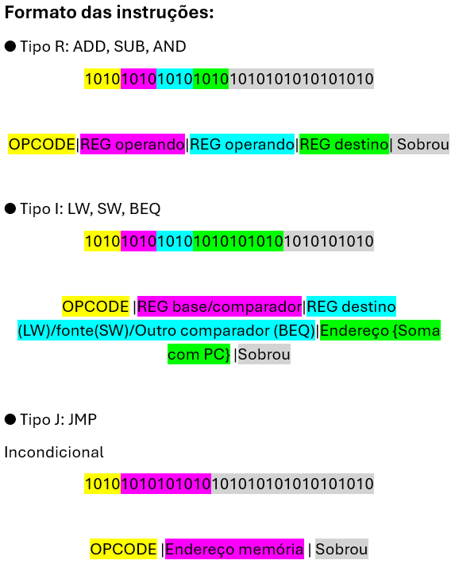
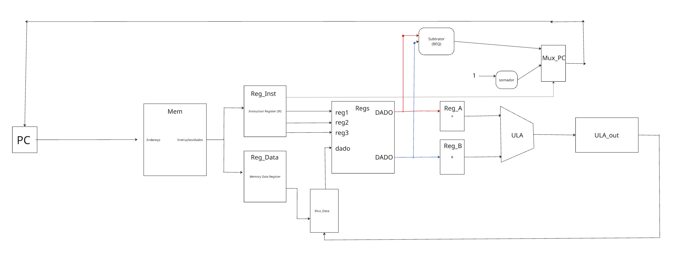

# 32-bit MIPS Processor Project
## Description
This project was developed by UERGS students for the Computer Organization course. It implements a simplified 32-bit MIPS processor architecture, designed to execute a selected set of instructions using a multicyle datapath and unified memory system.
## Instruction Set
The processor supports six core MIPS instructions:
- ADD – Arithmetic addition (R-type)
- SUB – Arithmetic subtraction (R-type)
- AND – Bitwise AND (R-type)
- LW – Load Word (I-type)
- SW – Store Word (I-type)
- BEQ – Branch if Equal (I-type)
- JUMP – Unconditional jump (J-type)
## Registers
- Total registers: 16 general-purpose registers (R0–R15)
- Register address size: 4 bits
## Memory
- Type: Unified memory for instructions and data
- Organization: 1024 words × 32 bits
- Addressing mode: Word addressing with base + offset for load/store instructions
## Instruction Formats
- R-type: Used for register-to-register operations
- I-type: Used for load, store, and branch operations
- J-type: Used for jump operations
- Instruction width: 32 bits (4 bytes)

## MIPS Control Unit
The control unit manages the processor through signals such as: MemRead, MemWrite, RegWrite, IRWrite, RegDst, MemtoReg, ALUSrc, ALUControl, PCWrite, PCSrc, and Branch.
Each signal defines how the processor behaves during the five execution stages: IF, ID, EX, MEM, and WB.
## MIPS Datapath Diagram

## Design Challenge
The chosen design challenge was to implement a working multicyle MIPS processor with 16 registers, maintaining full support for all six instruction types and proper control signal sequencing.
## Collaborators
- Nícolas Evangelista (@nickevangelista)
- Lorenzo Schaffer (@Leperes04)
